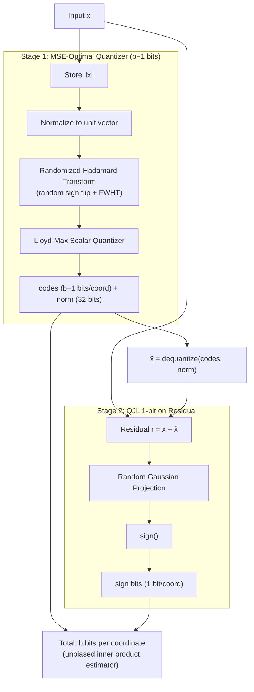

# turboquant-torch

[](https://github.com/codepawl/turboquant-torch/actions/workflows/ci.yml)
[](https://pypi.org/project/turboquant-torch/)
[](https://test.pypi.org/project/turboquant-torch/)
[](https://github.com/astral-sh/ruff)
[](https://opensource.org/licenses/MIT)

Unofficial PyTorch reference implementation of **TurboQuant** from Google Research (ICLR 2026).

**Paper:** [TurboQuant: Redefining AI Efficiency with Extreme Compression](https://arxiv.org/abs/2504.19874)
**Blog:** [Google Research Blog](https://research.google/blog/turboquant-redefining-ai-efficiency-with-extreme-compression/)

TurboQuant is a **two-stage online (data-oblivious) vector quantizer** that achieves near information-theoretic optimal distortion. No training data needed — just plug in and compress.

## Overview


## How It Works



### Key Properties

- **Online / data-oblivious** — no training, no calibration data, no k-means
- **Near-optimal** — within ~2.7x of Shannon lower bound
- **Accelerator-friendly** — all ops are vectorizable (no branching)
- **Zero indexing time** — vs Product Quantization which needs k-means training

## Installation

```bash
pip install turboquant-torch
```

### From source (development)

```bash
git clone https://github.com/codepawl/turboquant-torch.git
cd turboquant-torch
pip install -e ".[dev]"
```

## 3 Lines to Compress Any LLM

```python
import turboquant
from transformers import AutoModelForCausalLM, AutoTokenizer

model = AutoModelForCausalLM.from_pretrained("Qwen/Qwen3-0.6B")
tokenizer = AutoTokenizer.from_pretrained("Qwen/Qwen3-0.6B")

model = turboquant.wrap(model)  # <-- one line
output = model.generate(**tokenizer("Hello", return_tensors="pt"), max_new_tokens=50)
```

KV cache automatically compressed to 3-bit. ~10x less memory.

For more control:

```python
model = turboquant.wrap(
    model,
    bit_width=3,              # 2, 3, or 4
    residual_length=128,      # sliding window
    n_outlier_channels=8,     # outlier routing
    verbose=True,             # print stats
)
```

Or use the cache directly:

```python
from turboquant import TurboQuantDynamicCache

cache = TurboQuantDynamicCache.from_model(model)
output = model.generate(**inputs, past_key_values=cache, max_new_tokens=50)
```

## Low-Level API

### Basic Quantize / Dequantize

```python
import torch
from turboquant import TurboQuant

tq = TurboQuant(dim=128, bit_width=3, unbiased=True)

x = torch.randn(100, 128)
output = tq.quantize(x)
x_hat = tq.dequantize(output)

print(f"Compression: {tq.compression_ratio():.1f}x")  # ~10.7x
```

### KV Cache Compression

```python
from turboquant import TurboQuantKVCache

cache = TurboQuantKVCache(head_dim=128, bit_width=3, residual_length=128)

# Compress KV tensors (batch, heads, seq, dim)
keys = torch.randn(2, 32, 2048, 128)
values = torch.randn(2, 32, 2048, 128)
compressed = cache.compress(keys, values)

# Attention with compressed cache
query = torch.randn(2, 32, 1, 128)
output = cache.attention(query, compressed)

orig_mb, comp_mb, ratio = cache.memory_savings(2, 32, 2048)
print(f"Memory: {orig_mb:.0f} MB -> {comp_mb:.0f} MB ({ratio:.1f}x)")
```

### Real Model Example

```python
import torch
from transformers import AutoModelForCausalLM, AutoTokenizer
from turboquant import TurboQuantKVCache

model = AutoModelForCausalLM.from_pretrained("Qwen/Qwen3-0.6B", dtype=torch.float32)
tokenizer = AutoTokenizer.from_pretrained("Qwen/Qwen3-0.6B")

with torch.no_grad():
    out = model(**tokenizer("The quick brown fox", return_tensors="pt"), use_cache=True)

kv = out.past_key_values
k, v = kv.layers[0].keys, kv.layers[0].values  # layer 0 KV cache
cache = TurboQuantKVCache(head_dim=k.shape[-1], bit_width=3)
compressed = cache.compress(k.float(), v.float())
```

### Sliding Window (Residual Buffer)

Keep recent tokens in fp16 for higher accuracy on local context:

```python
cache = TurboQuantKVCache(
    head_dim=128,
    bit_width=3,
    residual_length=128,  # last 128 tokens stay in fp16
)
```

### GQA/MQA Support

For models with grouped query attention (Llama-3, Mistral, etc.):

```python
cache = TurboQuantKVCache.for_gqa(
    head_dim=128,
    num_kv_heads=8,       # Llama-3-8B
    num_query_heads=32,
    bit_width=3,
    residual_length=128,
)
# Keys auto-bumped to 4-bit to compensate for GQA error amplification
```

### Outlier Channel Routing

Preserve high-magnitude channels in full precision (inspired by KVQuant/GEAR):

```python
cache = TurboQuantKVCache(
    head_dim=128,
    bit_width=3,
    n_outlier_channels=8,   # top-8 channels kept in fp16
    residual_length=128,
)
```

### Adaptive Per-Layer Bit Allocation

Different layers get different bit budgets:

```python
from turboquant import AdaptiveKVCache, gradient_allocation

# Manual: 2-bit for early layers, 4-bit for late layers
cache = AdaptiveKVCache(
    head_dim=128,
    layer_bits=[2]*10 + [3]*12 + [4]*10,  # 32 layers total
)

# Gradient allocation: smooth 2→4 bit ramp
bits = gradient_allocation(n_layers=32, min_bits=2, max_bits=4, strategy="linear")
cache = AdaptiveKVCache(head_dim=128, layer_bits=bits)

# Auto-calibrated from model (requires HuggingFace model)
cache = AdaptiveKVCache.from_model(
    model, tokenizer,
    head_dim=128,
    target_avg_bits=3.0,
)
print(cache.summary())
```

### Vector Search

```python
from turboquant import TurboQuantIndex

index = TurboQuantIndex(dim=128, bit_width=3, metric="ip")
index.add(database_vectors)  # Near-instant, no training!
scores, indices = index.search(query, k=10)
```

## Real-World Usage

### Compress a live model's KV cache

```python
import torch
from transformers import AutoModelForCausalLM, AutoTokenizer
from turboquant import TurboQuantKVCache

model = AutoModelForCausalLM.from_pretrained("Qwen/Qwen3-0.6B", dtype=torch.float32)
tokenizer = AutoTokenizer.from_pretrained("Qwen/Qwen3-0.6B")

inputs = tokenizer("Explain quantum computing in simple terms:", return_tensors="pt").to(model.device)
with torch.no_grad():
    out = model(**inputs, use_cache=True)

past_kv = out.past_key_values
head_dim = past_kv.layers[0].keys.shape[-1]
cache = TurboQuantKVCache(head_dim=head_dim, bit_width=3, residual_length=0)

for i in range(len(past_kv.layers)):
    k, v = past_kv.layers[i].keys.float(), past_kv.layers[i].values.float()
    compressed = cache.compress(k, v)
    k_hat = cache.decompress_keys(compressed)
    print(f"Layer {i}: MSE={((k - k_hat)**2).mean():.6f}")
```

### Generate text with compressed KV cache

```python
from transformers import DynamicCache

with torch.no_grad():
    out = model(**inputs, use_cache=True)

new_cache = DynamicCache()
for i in range(len(out.past_key_values.layers)):
    k = out.past_key_values.layers[i].keys.float()
    v = out.past_key_values.layers[i].values.float()
    compressed = cache.compress(k, v)
    k_hat = cache.decompress_keys(compressed).to(k.dtype)
    v_hat = cache.decompress_values(compressed).to(v.dtype)
    new_cache.update(k_hat, v_hat, i)

outputs = model.generate(
    **inputs, past_key_values=new_cache,
    max_new_tokens=50, do_sample=False,
)
print(tokenizer.decode(outputs[0], skip_special_tokens=True))
```

### Multi-layer adaptive compression

```python
from turboquant import AdaptiveKVCache

adaptive = AdaptiveKVCache.from_model(
    model, tokenizer, head_dim=head_dim, target_avg_bits=3.0
)
print(adaptive.summary())

for i in range(adaptive.n_layers):
    k = past_kv.layers[i].keys.float()
    v = past_kv.layers[i].values.float()
    compressed = adaptive.compress_layer(i, k, v)
```

## Compatibility

Works with any standard transformer KV cache:

| Model Family | Status | Notes |
|---|---|---|
| Llama-3 / 3.1 / 3.2 | Full support | GQA-aware mode recommended |
| Mistral / Mixtral | Full support | Sliding window auto-detected |
| Gemma / Gemma 2 | Full support | |
| Qwen2.5 / Qwen3 | Full support | |
| Phi-3 / Phi-4 | Full support | |
| Command-R | Full support | |
| DeepSeek-V2/V3 | Skip MLA layers | KV already compressed by MLA |
| Qwen3.5 / Jamba | Attention layers only | Non-attention layers skipped |
| T5 / BART / mBART | Partial | Self-attention KV only |
| Mamba / RWKV | Not applicable | No KV cache (SSM/RNN) |

Use `compress_model_kv()` for automatic handling:

```python
from turboquant.compat import compress_model_kv

compressed_cache = compress_model_kv(past_key_values, model, bit_width=3)
outputs = model.generate(**inputs, past_key_values=compressed_cache, max_new_tokens=50)
```

## Distortion vs Bit Width

From paper Table 1 (MSE distortion on unit vectors):

| Bits/coord | MSE Distortion | Compression Ratio |
|:----------:|:--------------:|:-----------------:|
| 1          | ~0.36          | 32x               |
| 2          | ~0.117         | 16x               |
| 3          | ~0.03          | 10.7x             |
| 4          | ~0.009         | 8x                |

3-bit achieves zero quality loss on LongBench, Needle-in-Haystack, ZeroSCROLLS, RULER, and L-Eval benchmarks.


### KV Cache Memory Savings


## Benchmarks on Real Models

Tested on [SmolLM2-135M](https://huggingface.co/HuggingFaceTB/SmolLM2-135M) KV cache (30 layers, 3 KV heads, head_dim=64):

| Bit-width | Key MSE | Attn Score MSE | Memory | Ratio |
|-----------|---------|----------------|--------|-------|
| 2-bit     | 1.8732  | 0.01798362     | 0.03 MB | 12.8x |
| 3-bit     | 0.5902  | 0.00741907     | 0.04 MB | 9.1x  |
| 4-bit     | 0.1740  | 0.00249073     | 0.06 MB | 7.1x  |

Full benchmark results: [benchmarks/results.md](benchmarks/results.md)


### KV Cache Memory at Scale


### Downstream Task Evaluation

Tested on Qwen3.5-4B (head_dim=256, 3-bit, RTX 3060, 200 samples/task):

| Task | fp16 | 3-bit | Diff |
|------|------|-------|------|
| HellaSwag | 37.0% | 38.5% | +1.5% |
| ARC-Easy | 49.0% | 49.5% | +0.5% |

Differences are within sampling variance, confirming compression preserves task accuracy.


### Sliding Window Effect


### GQA Error Amplification


## Project Structure

```
turboquant/
├── __init__.py          # Public API
├── hadamard.py          # Fast Walsh-Hadamard Transform + random rotation
├── codebook.py          # Lloyd-Max optimal scalar quantizer codebooks
├── qjl.py               # Quantized Johnson-Lindenstrauss (1-bit)
├── mse_quantizer.py     # MSE-optimal quantizer (rotation + Lloyd-Max)
├── core.py              # TurboQuant two-stage pipeline
├── kv_cache.py          # KV cache compression for transformers
├── outlier.py           # Outlier channel detection and routing
├── adaptive.py          # Adaptive per-layer bit allocation
├── compat.py            # Model architecture compatibility detection
└── vector_search.py     # Approximate nearest neighbor index
```

## Differences from Paper

| Aspect | Paper | This Repo |
|--------|-------|-----------|
| Framework | JAX/XLA | PyTorch |
| CUDA kernels | Custom fused kernels for H100 | Pure PyTorch (no custom CUDA) |
| Entropy coding | Optional (Section 3.1) | Not implemented |
| HuggingFace | N/A | KV cache compression ([examples/](examples/01_quickstart.ipynb)) |
| Codebook | Exact precomputed | Lloyd-Max iterative (equivalent) |

Custom CUDA kernels for fused Hadamard + quantize operations would be a valuable future contribution.

## Examples

| Notebook | What it shows |
|----------|---------------|
| [01_quickstart.ipynb](examples/01_quickstart.ipynb) | 3-line compression, before/after comparison |
| [02_long_context.ipynb](examples/02_long_context.ipynb) | Memory scaling, sliding window, outlier routing |
| [03_adaptive_compression.ipynb](examples/03_adaptive_compression.ipynb) | Per-layer sensitivity, adaptive bit allocation |

Each notebook has an "Open in Colab" badge and runs on CPU (free tier).

## Running Tests

```bash
pip install -e ".[dev]"
pytest tests/unit/ -v              # fast, isolated
pytest tests/integration/ -v       # multi-module
pytest tests/unit/ tests/integration/ -v  # all
```

## Contributing

We welcome contributions! Here's how to get started:

1. Fork the repo and create a feature branch from `staging`
2. Install dev dependencies: `pip install -e ".[dev]"`
3. Make changes and add tests
4. Run checks:
```bash
   ruff check turboquant/ tests/
   ruff format turboquant/ tests/
   mypy turboquant/
   pytest tests/ -v
```
5. Open a PR against `staging` (not `main`)

See our [branching strategy](CLAUDE.md): feature branches → staging → main.

### Areas where help is needed

- **CUDA/Triton kernels** — fused Hadamard + quantize for 10x speedup
- **vLLM integration** — PagedAttention compatibility
- **More model benchmarks** — Llama-3, Mistral, Gemma on downstream tasks
- **Entropy coding** — optional compression from paper Section 3.1

## Community

- GitHub Issues: [github.com/codepawl/turboquant-torch/issues](https://github.com/codepawl/turboquant-torch/issues)
- Discord: [discord.gg/7fydHgK6kA](https://discord.gg/7fydHgK6kA)
- X: [@codepawl](https://x.com/codepawl)

## Citation

```bibtex
@inproceedings{turboquant2026,
  title={TurboQuant: Redefining AI Efficiency with Extreme Compression},
  author={Zandieh, Amir and Daliri, Majid and Hadian, Majid and Mirrokni, Vahab},
  booktitle={International Conference on Learning Representations (ICLR)},
  year={2026},
  url={https://arxiv.org/abs/2504.19874}
}
```

## Related Work

- [QJL: 1-Bit Quantized JL Transform](https://arxiv.org/abs/2406.03482) — the 1-bit quantizer used in Stage 2. The official QJL implementation by the paper authors is available at [github.com/amirzandieh/QJL](https://github.com/amirzandieh/QJL).
- [PolarQuant](https://arxiv.org/abs/2502.02617) — related polar coordinate quantization approach

## Documentation

- [Quick Start](docs/quickstart.md)
- [API Reference](docs/api-reference.md)
- [Model Compatibility](docs/compatibility.md)
- [Changelog](CHANGELOG.md)

## License

MIT
