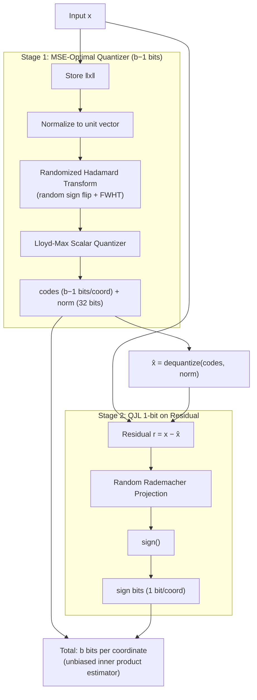

# turboquant-torch

Unofficial PyTorch reference implementation of **TurboQuant** from Google Research (ICLR 2026).

**Paper:** [TurboQuant: Redefining AI Efficiency with Extreme Compression](https://arxiv.org/abs/2504.19874)
**Blog:** [Google Research Blog](https://research.google/blog/turboquant-redefining-ai-efficiency-with-extreme-compression/)

TurboQuant is a **two-stage online (data-oblivious) vector quantizer** that achieves near information-theoretic optimal distortion. No training data needed — just plug in and compress.

## How It Works



### Key Properties

- **Online / data-oblivious** — no training, no calibration data, no k-means
- **Near-optimal** — within ~2.7x of Shannon lower bound
- **Accelerator-friendly** — all ops are vectorizable (no branching)
- **Zero indexing time** — vs Product Quantization which needs k-means training

## Installation

```bash
# From source
git clone https://github.com/your-username/turboquant-torch.git
cd turboquant-torch
pip install -e ".[dev]"
```

### Dependencies

- `torch >= 2.0`
- `numpy >= 1.24`
- `scipy >= 1.10`
- `pytest >= 7.0` (dev)

## Quick Start

### Basic Quantize / Dequantize

```python
import torch
from turboquant import TurboQuant

tq = TurboQuant(dim=128, bit_width=3, unbiased=True)

x = torch.randn(100, 128)
output = tq.quantize(x)
x_hat = tq.dequantize(output)

print(f"Compression: {tq.compression_ratio():.1f}x")  # ~10.7x
```

### KV Cache Compression

```python
from turboquant import TurboQuantKVCache

cache = TurboQuantKVCache(head_dim=128, bit_width=3)

# Compress KV tensors (batch, heads, seq, dim)
keys = torch.randn(2, 32, 2048, 128)
values = torch.randn(2, 32, 2048, 128)
compressed = cache.compress(keys, values)

# Attention with compressed cache
query = torch.randn(2, 32, 1, 128)
output = cache.attention(query, compressed)

orig_mb, comp_mb, ratio = cache.memory_savings(2, 32, 2048)
print(f"Memory: {orig_mb:.0f} MB -> {comp_mb:.0f} MB ({ratio:.1f}x)")
```

### Vector Search

```python
from turboquant import TurboQuantIndex

index = TurboQuantIndex(dim=128, bit_width=3, metric="ip")
index.add(database_vectors)  # Near-instant, no training!
scores, indices = index.search(query, k=10)
```

## Distortion vs Bit Width

From paper Table 1 (MSE distortion on unit vectors):

| Bits/coord | MSE Distortion | Compression Ratio |
|:----------:|:--------------:|:-----------------:|
| 1          | ~0.36          | 32x               |
| 2          | ~0.117         | 16x               |
| 3          | ~0.03          | 10.7x             |
| 4          | ~0.009         | 8x                |

3-bit achieves zero quality loss on LongBench, Needle-in-Haystack, ZeroSCROLLS, RULER, and L-Eval benchmarks.

## Project Structure

```
turboquant/
├── __init__.py          # Public API
├── hadamard.py          # Fast Walsh-Hadamard Transform + random rotation
├── codebook.py          # Lloyd-Max optimal scalar quantizer codebooks
├── qjl.py               # Quantized Johnson-Lindenstrauss (1-bit)
├── mse_quantizer.py     # MSE-optimal quantizer (rotation + Lloyd-Max)
├── core.py              # TurboQuant two-stage pipeline
├── kv_cache.py          # KV cache compression for transformers
└── vector_search.py     # Approximate nearest neighbor index
```

## Differences from Paper

| Aspect | Paper | This Repo |
|--------|-------|-----------|
| Framework | JAX/XLA | PyTorch |
| CUDA kernels | Custom fused kernels for H100 | Pure PyTorch (no custom CUDA) |
| Entropy coding | Optional (Section 3.1) | Not implemented |
| HuggingFace | N/A | Not integrated (standalone) |
| Codebook | Exact precomputed | Lloyd-Max iterative (equivalent) |

Custom CUDA kernels for fused Hadamard + quantize operations would be a valuable future contribution.

## Running Tests

```bash
pip install -e ".[dev]"
pytest tests/ -v
```

## Citation

```bibtex
@inproceedings{turboquant2026,
  title={TurboQuant: Redefining AI Efficiency with Extreme Compression},
  author={Google Research},
  booktitle={International Conference on Learning Representations (ICLR)},
  year={2026},
  url={https://arxiv.org/abs/2504.19874}
}
```

## Related Work

- [QJL: 1-Bit Quantized JL Transform](https://arxiv.org/abs/2406.03482) — the 1-bit quantizer used in Stage 2
- [PolarQuant](https://arxiv.org/abs/2502.17575) — related polar coordinate quantization approach

## License

MIT
