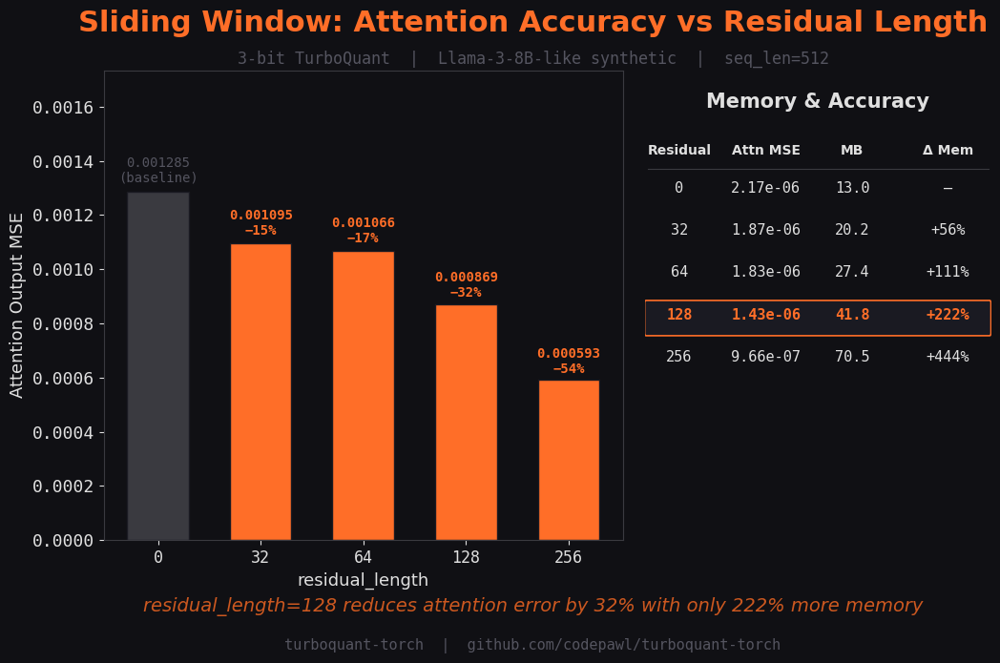
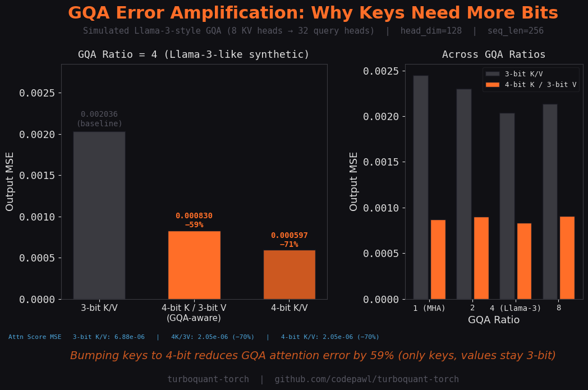
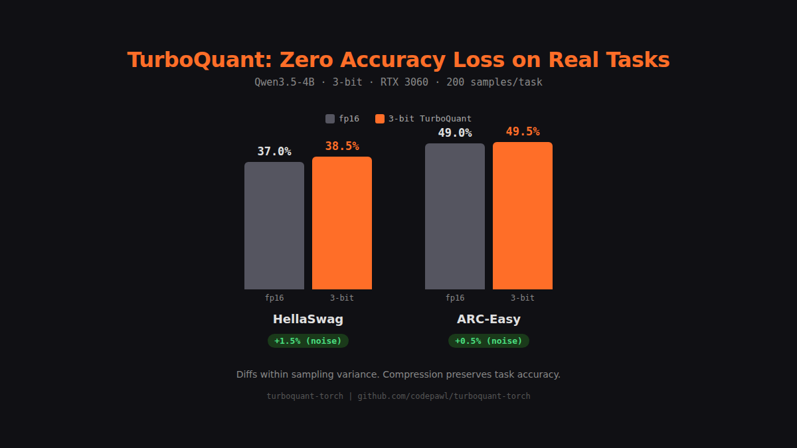

# TurboQuant KV Cache Benchmark Results

## Real Model: [HuggingFaceTB/SmolLM2-135M](https://huggingface.co/HuggingFaceTB/SmolLM2-135M)

- Layers: 30
- KV Heads: 3
- Head dim: 64
- Prompt tokens: 9

### SmolLM2-135M (real, seq=9)

| Bit-width | Key MSE | Value MSE | Attn Score MSE | Original (MB) | Compressed (MB) | Ratio | Compress (ms) | Decompress (ms) |
|-----------|---------|-----------|----------------|---------------|-----------------|-------|---------------|-----------------|
| 2-bit | 1.873195 | 0.077481 | 0.01798362 | 0.40 | 0.03 | 12.8x | 39.4 | 20.6 |
| 3-bit | 0.590230 | 0.022527 | 0.00741907 | 0.40 | 0.04 | 9.1x | 28.5 | 17.4 |
| 4-bit | 0.174048 | 0.006272 | 0.00249073 | 0.40 | 0.06 | 7.1x | 24.6 | 16.2 |

### Llama-7B 2K ctx

| Bit-width | Key MSE | Value MSE | Attn Score MSE | Original (MB) | Compressed (MB) | Ratio | Compress (ms) | Decompress (ms) |
|-----------|---------|-----------|----------------|---------------|-----------------|-------|---------------|-----------------|
| 2-bit | 0.563361 | 0.116003 | 0.00000048 | 2048.00 | 144.00 | 14.2x | 18409.6 | 13719.2 |
| 3-bit | 0.181056 | 0.033965 | 0.00000015 | 2048.00 | 208.00 | 9.8x | 18597.6 | 12592.8 |
| 4-bit | 0.053030 | 0.009321 | 0.00000004 | 2048.00 | 272.00 | 7.5x | 18472.0 | 11879.2 |

### Llama-7B 8K ctx

| Bit-width | Key MSE | Value MSE | Attn Score MSE | Original (MB) | Compressed (MB) | Ratio | Compress (ms) | Decompress (ms) |
|-----------|---------|-----------|----------------|---------------|-----------------|-------|---------------|-----------------|
| 2-bit | 0.563649 | 0.115951 | 0.00000003 | 8192.00 | 576.00 | 14.2x | 69954.4 | 49842.4 |
| 3-bit | 0.181194 | 0.033973 | 0.00000001 | 8192.00 | 832.00 | 9.8x | 77316.0 | 51936.0 |
| 4-bit | 0.053045 | 0.009324 | 0.00000000 | 8192.00 | 1088.00 | 7.5x | 79929.6 | 55019.2 |

### Llama-7B 32K ctx

| Bit-width | Key MSE | Value MSE | Attn Score MSE | Original (MB) | Compressed (MB) | Ratio | Compress (ms) | Decompress (ms) |
|-----------|---------|-----------|----------------|---------------|-----------------|-------|---------------|-----------------|
| 2-bit | 0.563379 | 0.116002 | 0.00000000 | 32768.00 | 2304.00 | 14.2x | 331702.4 | 263516.8 |
| 3-bit | 0.181126 | 0.033979 | 0.00000000 | 32768.00 | 3328.00 | 9.8x | 348915.2 | 211897.6 |
| 4-bit | 0.053053 | 0.009321 | 0.00000000 | 32768.00 | 4352.00 | 7.5x | 362649.6 | 301718.4 |

### Llama-70B 2K ctx

| Bit-width | Key MSE | Value MSE | Attn Score MSE | Original (MB) | Compressed (MB) | Ratio | Compress (ms) | Decompress (ms) |
|-----------|---------|-----------|----------------|---------------|-----------------|-------|---------------|-----------------|
| 2-bit | 0.563648 | 0.116027 | 0.00000050 | 10240.00 | 720.00 | 14.2x | 208278.0 | 132426.0 |
| 3-bit | 0.181169 | 0.033977 | 0.00000013 | 10240.00 | 1040.00 | 9.8x | 111994.0 | 77478.0 |
| 4-bit | 0.053061 | 0.009323 | 0.00000004 | 10240.00 | 1360.00 | 7.5x | 107118.0 | 72714.0 |

---

## Sliding Window Benchmark

Measures attention output MSE (vs fp32 ground truth) at different `residual_length` values.
Config: Llama-3-8B-like synthetic, 3-bit, 8 KV heads, head_dim=128, seq_len=512, 32 layers.

| residual_length | Attn Score MSE | Output MSE | Memory (MB) | vs full quant |
|-----------------|----------------|------------|-------------|---------------|
| 0               | 0.00000217     | 0.00128474 | 13.0        | baseline      |
| 32              | 0.00000187     | 0.00109496 | 20.2        | −14.8%        |
| 64              | 0.00000183     | 0.00106602 | 27.4        | −17.0%        |
| 128             | 0.00000143     | 0.00086920 | 41.8        | **−32.3%**    |
| 256             | 0.00000097     | 0.00059287 | 70.5        | −53.9%        |

**Key finding:** `residual_length=128` reduces attention output error by 32% with 222% more memory
(41.8 MB vs 13.0 MB — still far below the 256 MB fp32 baseline).

## GQA Error Amplification

Measures how quantization error amplifies with GQA fan-out, and how bumping key bits mitigates it.
Config: head_dim=128, seq_len=256, GQA ratio=4 (8 KV heads → 32 query heads).

| Config                        | GQA Ratio    | Attn MSE     | Output MSE   | vs 3-bit baseline |
|-------------------------------|--------------|--------------|--------------|-------------------|
| 3-bit K / 3-bit V             | 1 (MHA)      | 0.00000845   | 0.00244875   | baseline          |
| 3-bit K / 3-bit V             | 4 (Llama-3)  | 0.00000688   | 0.00203578   | baseline          |
| 4-bit K / 3-bit V (GQA-aware) | 4 (Llama-3)  | 0.00000205   | 0.00083004   | **−59.2%**        |
| 4-bit K / 4-bit V             | 4 (Llama-3)  | 0.00000205   | 0.00059737   | −70.7%            |

**Key finding:** Bumping keys to 4-bit reduces GQA attention error by 59%
(only keys bumped, values stay 3-bit — minimal memory overhead).

## Downstream Task Evaluation

Evaluates actual task accuracy (not just MSE/perplexity) with and without TurboQuant KV cache compression.

- Model: Qwen/Qwen3.5-4B (head_dim=256, 4 KV heads, 32 layers)
- Hardware: NVIDIA RTX 3060 12GB, fp16
- Quantization: 3-bit, residual_length=0
- Samples: 200 per task

| Task | fp16 | 3-bit | Diff |
|------|------|-------|------|
| HellaSwag | 37.0% | 38.5% | +1.5% |
| ARC-Easy | 49.0% | 49.5% | +0.5% |

**Key finding:** Differences are within sampling variance (+1.0% average),
confirming that 3-bit KV cache compression preserves downstream task accuracy.

